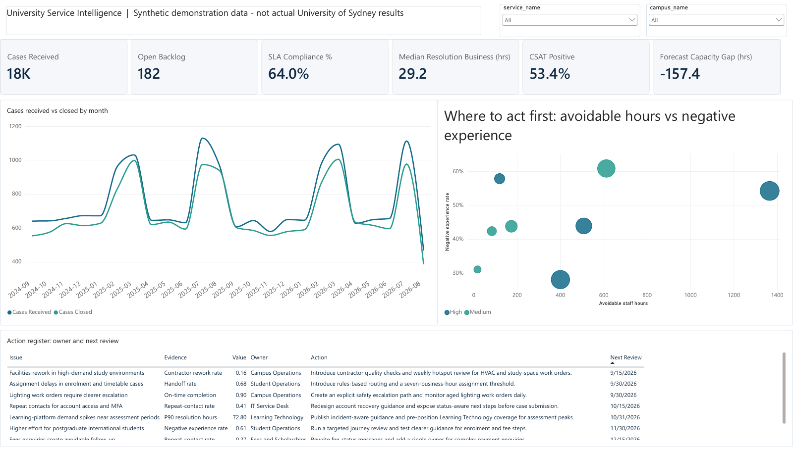

# University Service Intelligence & Action Hub

An end-to-end, synthetic analytics portfolio project designed around the Analytics Specialist position description. It identifies operational bottlenecks affecting staff and students, turns evidence into owned actions, and provides a reproducible path from raw data to Power BI and a lightweight analytics application.

> **Synthetic demonstration data:** no output represents actual University of Sydney performance.

## What is implemented

- 24 months of deterministic synthetic data across cases, workflow events, interactions, feedback, workforce capacity, contractor work orders, digital journeys, population denominators and interventions.
- A curated star schema with explicit edge-case and data-quality treatment.
- Transparent operational, experience, equity and benefit measures.
- A seasonal demand forecast with a 12-week outlook, uncertainty bounds and holdout WAPE evaluation.
- Eight evidence-backed actions with owner, baseline, target, success measure and review date.
- A four-page Power BI report (.pbix, PDF and screenshots), plus the theme, DAX library and browser-only build guide used to create it.
- A read-only Analytics Action Console with JSON APIs and a capacity scenario calculator.
- A formula-linked Excel implementation pack covering QA, model definitions and JD traceability.

## Quick start

Generate or reproduce the data:

```bash
python3 scripts/generate_synthetic_data.py
```

Run the application:

```bash
python3 analytics_app/server.py
```

Then open `http://127.0.0.1:8765`.

Run validation tests:

```bash
python3 -m unittest tests/test_analytics_app.py -v
```

## Power BI report



The report was built entirely in the Power BI service (browser only) on the curated data in this repository. Four pages:

| Page | Question it answers | Screenshot |
|---|---|---|
| Executive Operational Health | Where should leaders act first? | [view](docs/screenshots/01-executive-operational-health.png) |
| Bottlenecks & Capacity | Where does work wait, and do resources match demand? | [view](docs/screenshots/02-bottlenecks-capacity.png) |
| Experience & Equity | Which users experience disproportionate friction? | [view](docs/screenshots/03-experience-equity.png) |
| Actions & Benefits | Who owns each response, and is it working? | [view](docs/screenshots/04-actions-benefits.png) |

- [powerbi/University_Service_Intelligence.pbix](powerbi/University_Service_Intelligence.pbix) contains the semantic model (relationships, 45 DAX measures) and the report. Open it in Power BI Desktop, or upload it to the Power BI service.
- [docs/University_Service_Intelligence.pdf](docs/University_Service_Intelligence.pdf) is a static export of all four pages.
- To rebuild from scratch, follow [powerbi/BUILD_GUIDE.md](powerbi/BUILD_GUIDE.md). [powerbi/power_query.pq](powerbi/power_query.pq) loads the curated CSVs with explicit column types, and [powerbi/measures.dax](powerbi/measures.dax) writes every measure to the model in one step from DAX query view. The guide's reconciliation table lists the KPI values the model must return.

## Position-description evidence

See [docs/jd_alignment.md](docs/jd_alignment.md) for requirement-level traceability. The project demonstrates Python, SQL, Power BI modelling, forecasting, data quality, student-lifecycle analysis, root-cause investigation, stakeholder-oriented recommendations, impact measurement and analytics application development. Snowflake/Azure are represented as a production target design rather than claimed deployment, and LLM-based AI is explicitly reserved for a reviewed future increment.

## Key files

- `data/curated/manifest.json` — row counts and validation status.
- `docs/data_dictionary.md` and `docs/metric_catalog.md` — data and measure contracts.
- `docs/source_to_curated.mmd` and `docs/star_schema.mmd` — architecture diagrams.
- `docs/stakeholder_brief.md` — decision framing and stakeholder acceptance criteria.
- `docs/productionisation_architecture.md` — sustainable delivery path.
- `sql/transform_and_validate.sql` and `sql/snowflake_target_ddl.sql` — transformation logic and production target.
- `outputs/university_service_intelligence/university_service_intelligence_implementation_pack.xlsx` — consolidated implementation evidence.

