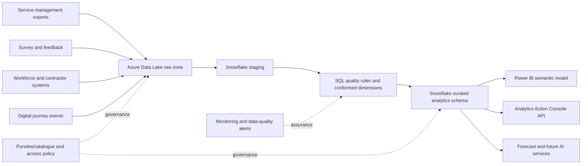

# Productionisation Architecture

The repository implements a local, reproducible reference pipeline. The following is a target production design, not a claim of deployment.

## Production controls

- Managed identity/service principal rather than embedded credentials.
- Row-level security by faculty or service owner where required.
- Development, test and production workspaces with deployment pipelines.
- Incremental refresh for case events and interactions.
- Source-to-target reconciliation, schema-drift alerts and failed-row quarantine.
- Model/version metadata for forecasts and future AI outputs.
- Human review, confidence thresholds and audit trail before AI-derived fields are published.

